# Proyecto 12: Disaster Recovery Active-Passive

**Universidad San Francisco Xavier de Chuquisaca**
**Carrera de Ciencias de la Computación**
**Infraestructura de Plataformas (SIS313)**
**Docente:** Ing. Marcelo Quispe Ortega
**Semestre:** 1/2026

## Integrantes

| Nombre completo | Rol en el proyecto | VM asignada |
|---|---|---|
| Llanos Rojas Jhonn Wilder | Lider tecnico - Site A, Keepalived, NGINX | site-a-master / site-a-backup |
| Montecinos Solis Camila Fernanda | Base de datos - MariaDB, RAID 5 | site-a-db |
| Maldonado Olmos Jose Luis | Sitio pasivo - Recuperacion, failover | site-b |
| Aillon Piccolomini Sebastian | Scripts, backups, automatizacion, documentacion | - |

---

## 1. Descripcion General del Proyecto

El proyecto consiste en disenar e implementar una infraestructura de recuperacion ante desastres bajo el esquema **Active-Passive**, utilizando maquinas virtuales en VirtualBox conectadas mediante ZeroTier para permitir el trabajo distribuido entre distintas laptops.

Se simulan dos centros de datos: un **Sitio Activo (Site A)** que opera normalmente con alta disponibilidad local mediante Keepalived, y un **Sitio Pasivo (Site B)** que permanece en espera recibiendo replicas periodicas de la base de datos. El proyecto demuestra dos mecanismos de continuidad de servicio:

- **Alta disponibilidad local (Keepalived):** si el nodo master de Site A falla, el nodo backup toma el control automaticamente en menos de 5 segundos mediante una IP virtual flotante (VIP).
- **Recuperacion ante desastres (Site B):** si Site A completo deja de funcionar, Site B restaura la base de datos desde el ultimo respaldo recibido y activa su propio servicio web, midiendo el tiempo de recuperacion (RTO).

### Temas avanzados integrados

| Codigo | Tema | Donde aparece |
|---|---|---|
| T2 | Almacenamiento RAID y tolerancia a fallos | RAID 5 con mdadm en site-a-db y site-b |
| T3 | Alta disponibilidad - Keepalived / VIP | Cluster active-passive en Site A |
| T9 | Bases de datos - MariaDB | BD principal en site-a-db, restauracion en site-b |
| T14 | Automatizacion con Bash | Scripts backup.sh y failover.sh |
| T15 | Backups automatizados y recuperacion | mysqldump + rsync cada 30 min, RTO medido |

---

## 2. Arquitectura de Red

```
                    Red ZeroTier (10.163.244.0/24)
                    Network ID: 633e31d8a2a83120

   SITE A (Jhonn)                                    SITE B (Jose Luis)
   ─────────────────────────                         ───────────────────
   VIP: 192.168.10.100                                site-b
                                                       ZT: 10.163.244.239
   site-a-master          site-a-backup               NGINX + MariaDB
   192.168.10.10           192.168.10.11               RAID 5 (md127)
   ZT: 10.163.244.33       ZT: 10.163.244.117           /opt/backups
   Keepalived MASTER       Keepalived BACKUP            failover.sh
   NGINX + Keepalived      NGINX standby
        │                                                    ▲
        │         SITE A-DB (Camila)                         │
        └────────► site-a-db                                 │
                   ZT: 10.163.244.251          backup.sh ─────┘
                   MariaDB + RAID 5            (mysqldump + rsync
                   BD: empresa                  cada 30 min)
```

### Tabla de infraestructura

| Hostname | Rol | SO | RAM / Disco | IP interna | IP ZeroTier | Responsable |
|---|---|---|---|---|---|---|
| site-a-master | MASTER - Keepalived, NGINX, VIP | Ubuntu 24.04 | 1 GB / 20 GB | 192.168.10.10 (VIP: .100) | 10.163.244.33 | Jhonn Llanos |
| site-a-backup | BACKUP - Keepalived, NGINX | Ubuntu 24.04 | 1 GB / 20 GB | 192.168.10.11 | 10.163.244.117 | Jhonn Llanos |
| site-a-db | Base de datos - MariaDB + RAID 5 | Ubuntu 24.04 | 1 GB / 20 GB + RAID | 10.0.2.15 (NAT) | 10.163.244.251 | Camila Montecinos |
| site-b | Sitio pasivo DR - NGINX + MariaDB | Ubuntu 24.04 | 1.5 GB / 20 GB + RAID | 10.0.2.15 (NAT) | 10.163.244.239 | Jose Luis Maldonado |

---

## 3. Configuracion de Red Interna y ZeroTier

### Red interna Site A (Keepalived)

- **Red:** `intnet-siteA` (Red interna de VirtualBox)
- **Subred:** 192.168.10.0/24
- **VIP:** 192.168.10.100

### Red ZeroTier (interconexion remota)

- **Network ID:** `633e31d8a2a83120`
- **Subred:** 10.163.244.0/24
- **Tipo de acceso:** Privado, aprobacion manual desde el panel de administracion

ZeroTier permite que las 4 VMs, distribuidas en 3 laptops distintas, se comuniquen entre si sin importar la red fisica (WiFi de casa, WiFi de la facultad, datos moviles), ya que cada VM mantiene siempre la misma IP dentro de la red virtual.

**Captura: configuracion de la red en el panel de ZeroTier**

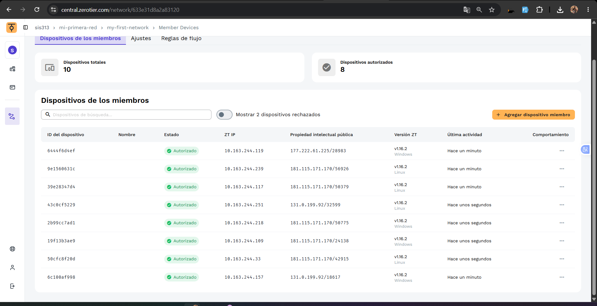

---

## 4. Hito 1 - Infraestructura Base y Conectividad

### 4.1 Maquinas virtuales levantadas y accesibles por SSH

**Captura: IP de site-a-master**

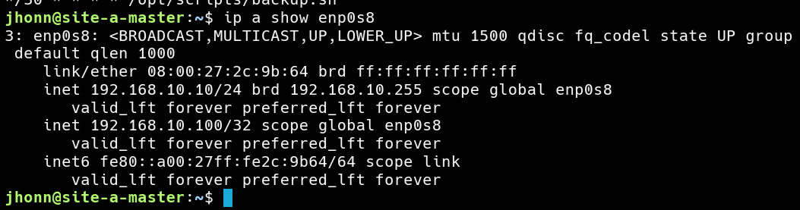

**Captura: IP de site-a-backup**

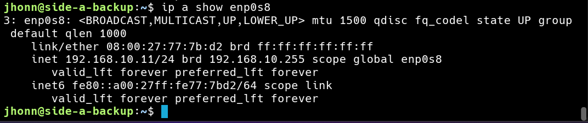

**Captura: IP de site-a-db**

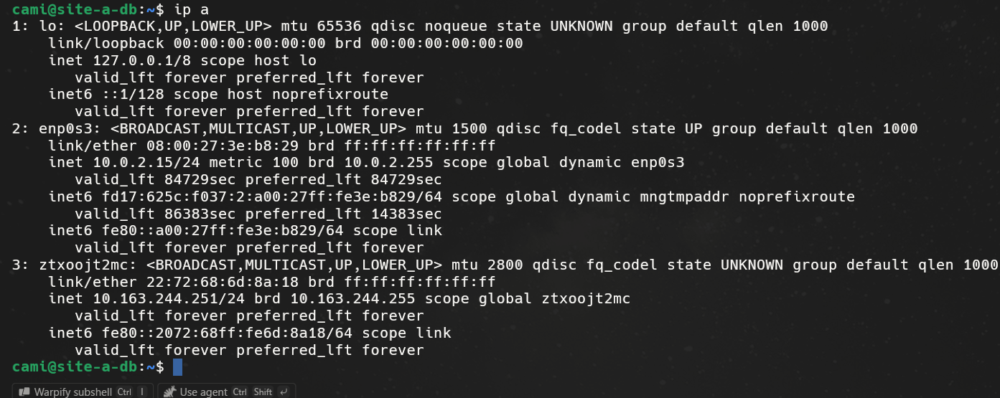

**Captura: IP de site-b**

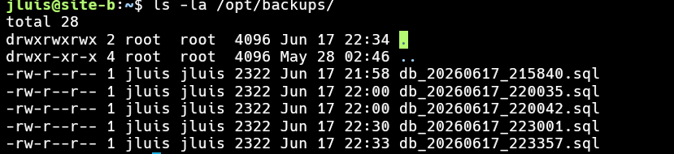

### 4.2 Conectividad verificada con ping cruzado

**Captura: ping desde site-a-master hacia site-a-backup**

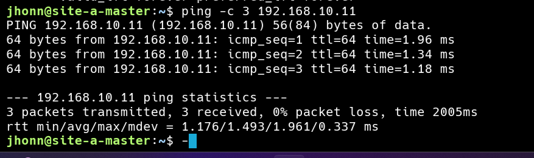

### 4.3 Servicio SSH activo

**Captura: estado de SSH en site-a-master**

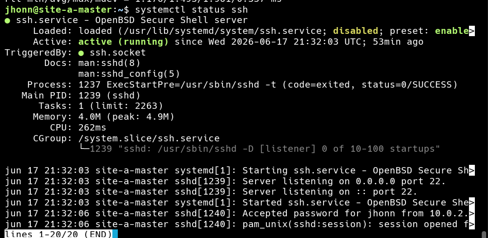

---

## 5. Hito 2 - Servicios Core en Ejecucion

### 5.1 T3 - Alta disponibilidad con Keepalived

La VIP `192.168.10.100` esta asignada al nodo MASTER. Ante una caida de NGINX, el `vrrp_script` detecta el fallo en 2 segundos y la prioridad efectiva baja de 101 a 41, forzando la migracion de la VIP hacia el nodo BACKUP en menos de 5 segundos.

**Captura: VIP asignada en site-a-master (estado normal)**

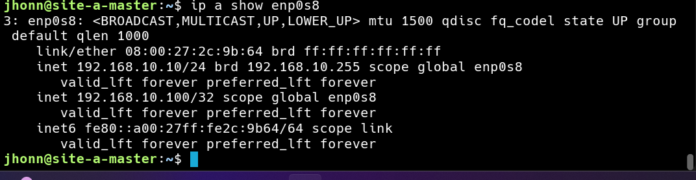

**Captura: deteniendo NGINX para simular falla**


**Captura: VIP migro a site-a-backup**

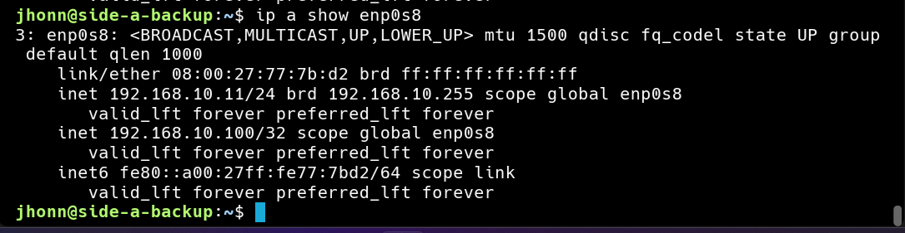

**Captura: NGINX restaurado, VIP de vuelta en master**

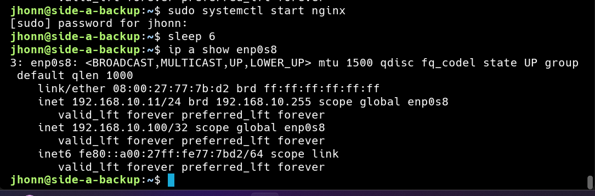

### 5.2 T9 - Base de datos centralizada MariaDB

**Captura: MariaDB activo en site-a-db**

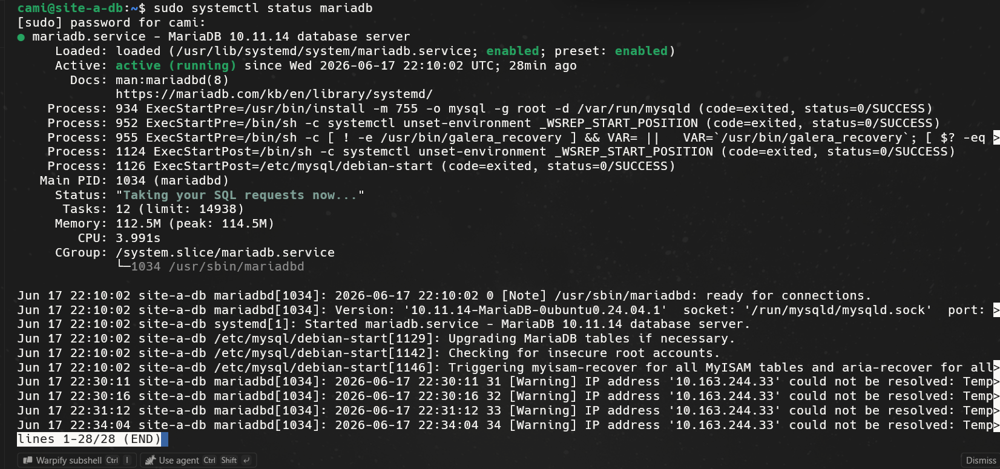

**Captura: conexion remota desde site-a-master mostrando datos de la tabla empleados**

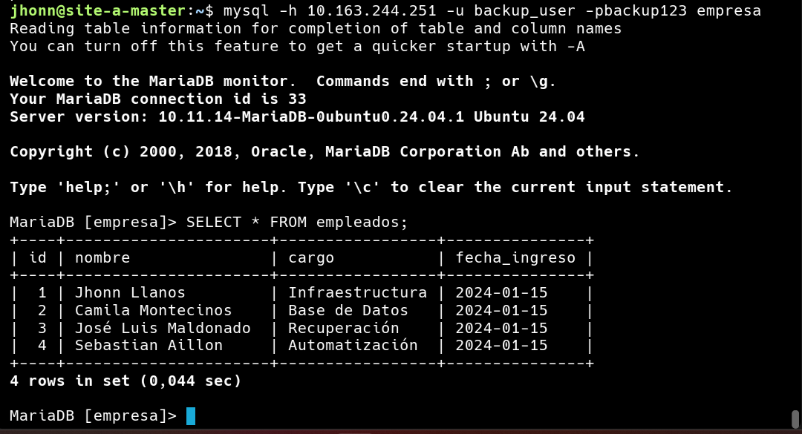

### 5.3 T2 - RAID 5 y almacenamiento

**Captura: estado del RAID 5 en site-a-db**

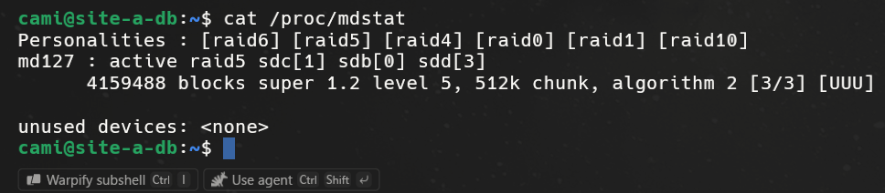

**Captura: RAID montado con espacio disponible**

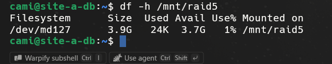

---

## 6. Hito 3 - Seguridad y Hardening

### 6.1 SSH endurecido

Se configuro `PermitRootLogin no` y `MaxAuthTries 3` en las 4 maquinas virtuales para impedir el acceso directo como root y limitar los intentos de autenticacion fallidos.

**Captura: configuracion SSH hardening**

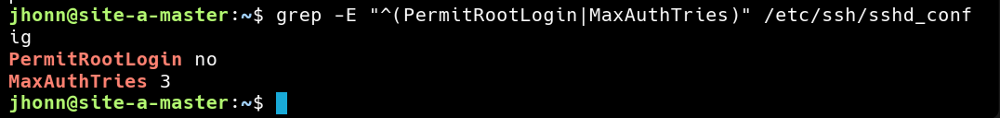

### 6.2 Firewall UFW activo

Se configuro UFW con politica `deny` por defecto en el trafico entrante, permitiendo unicamente los puertos estrictamente necesarios (SSH, HTTP, MariaDB segun la VM) y el trafico proveniente de la interfaz ZeroTier.

**Captura: estado de UFW en site-a-master**

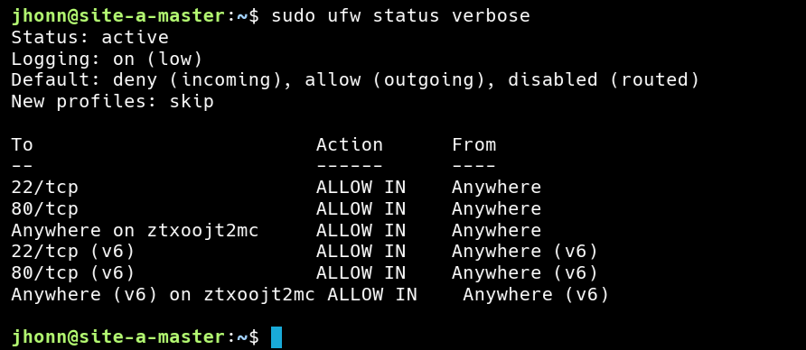

### 6.3 Permisos diferenciados

Se aplicaron permisos restrictivos en los directorios criticos del proyecto.

**Captura: permisos en /var/www/ y /opt/scripts**

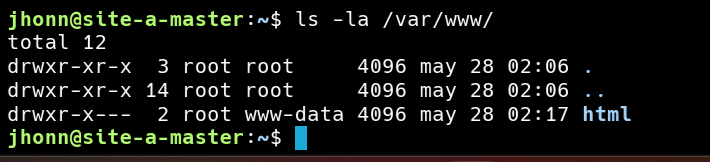

---

## 7. Backup Automatizado y Recuperacion ante Desastres

### 7.1 Script backup.sh

Ejecutado en `site-a-master` mediante cron cada 30 minutos. Realiza un `mysqldump` remoto contra `site-a-db` y transfiere el archivo via `rsync` sobre SSH hacia `site-b`.

```bash
#!/bin/bash
DB_HOST="10.163.244.251"
DB_USER="backup_user"
DB_PASS="backup123"
DB_NAME="empresa"
SITE_B_IP="10.163.244.239"
SITE_B_USER="jluis"
REMOTE_DIR="/opt/backups"
BACKUP_DIR="/tmp/backups"
TIMESTAMP=$(date +%Y%m%d_%H%M%S)

mkdir -p $BACKUP_DIR
mysqldump -h $DB_HOST -u $DB_USER -p$DB_PASS $DB_NAME > $BACKUP_DIR/db_$TIMESTAMP.sql
rsync -az $BACKUP_DIR/db_$TIMESTAMP.sql $SITE_B_USER@$SITE_B_IP:$REMOTE_DIR/
```

**Captura: cron job configurado**

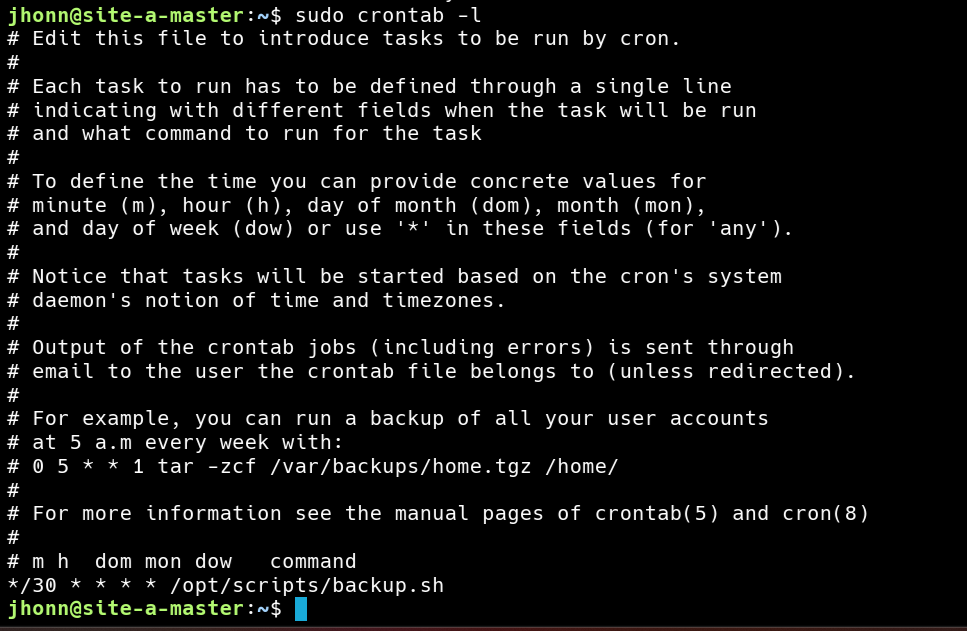

**Captura: ejecucion manual del backup.sh**

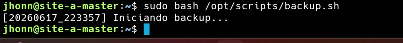

**Captura: log de backups completados**

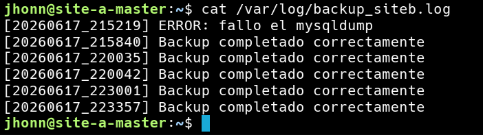

**Captura: archivos de respaldo recibidos en site-b**

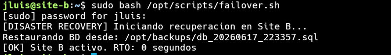

### 7.2 Script failover.sh

Ejecutado manualmente en `site-b` ante un desastre. Restaura el dump mas reciente en la base de datos local y activa NGINX, registrando el tiempo de recuperacion (RTO).

```bash
#!/bin/bash
BACKUP_DIR="/opt/backups"
DB_NAME="empresa"
START=$(date +%s)
LATEST=$(ls -t $BACKUP_DIR/db_*.sql 2>/dev/null | head -1)
mysql -u restore_user -prestore123 $DB_NAME < $LATEST
sudo systemctl start nginx
END=$(date +%s)
RTO=$((END - START))
echo "[OK] Site B activo. RTO: ${RTO} segundos"
```

**Captura: ejecucion de failover.sh con RTO medido**

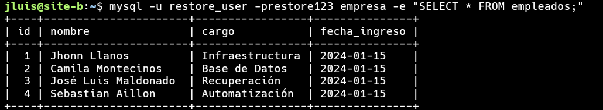

**Captura: datos verificados correctamente en site-b tras la restauracion**

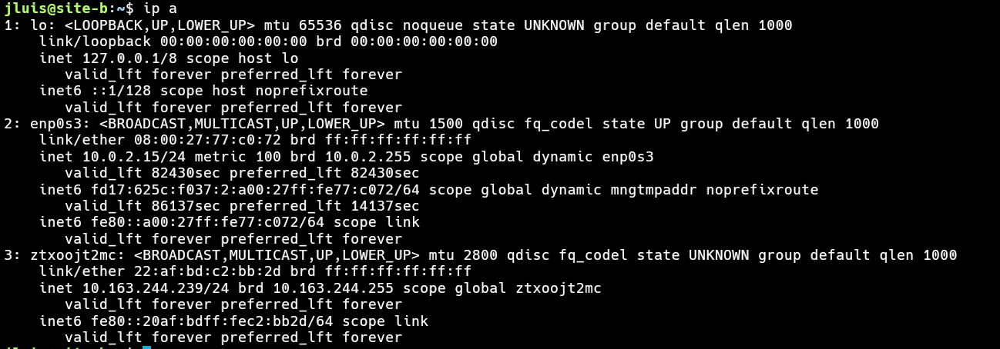

---

## 8. RTO y RPO

| Metrica | Valor teorico | Valor medido |
|---|---|---|
| RTO (Recovery Time Objective) | menor a 5 minutos | ver captura 23 |
| RPO (Recovery Point Objective) | maximo 30 minutos | definido por el intervalo del cron |

**RTO:** tiempo maximo aceptable que el sistema puede estar fuera de servicio tras un fallo. Se mide desde el inicio de la ejecucion de `failover.sh` hasta que el servicio web vuelve a responder en site-b.

**RPO:** maxima perdida de datos aceptable expresada en tiempo. Con backups cada 30 minutos, en el peor caso se pierden los cambios realizados en los ultimos 30 minutos antes del desastre.

---

## 9. Bitacora de Avance

Ver archivo [bitacora.md](bitacora.md) con el detalle cronologico de cada actividad realizada, responsable y dificultades superadas.

---

## 10. Diagrama de Arquitectura

Ver archivo [diagrama.md](diagrama.md) para el diagrama completo con leyenda de estado (operativo / en configuracion / pendiente).

---

## 11. Conclusiones

El proyecto demuestra de forma practica los dos pilares de la continuidad de servicio en infraestructura: la **alta disponibilidad local** mediante Keepalived, que responde a fallos en segundos sin intervencion humana, y la **recuperacion ante desastres** mediante un sitio pasivo geograficamente (o logicamente) separado, que permite restaurar el servicio en minutos ante la perdida total de un sitio. La combinacion de RAID 5 para tolerancia a fallos de disco, backups automatizados y scripts de failover documentados conforma una solucion robusta y reproducible para escenarios reales de infraestructura empresarial.
